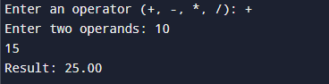
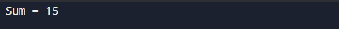
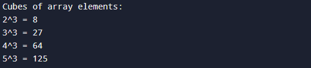
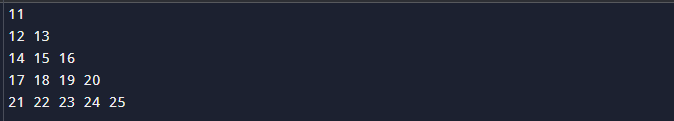

# C Programming Exercises

This repository contains solutions to several basic C programming tasks, including:

1. **✅Simple Calculator**  
   A program that performs addition, subtraction, multiplication, and division based on user input.
   

2. **✅Sum of Elements in an Array**  
   Calculates the sum of elements in an array using a function.
   

3. **✅Reverse Array and Sum**  
   Prints the elements of an array in reverse order and calculates their sum.
   

4. **✅Cube of Array Elements Using Pointer**  
   Computes and prints the cube of each element in an array using pointers.
   

5. **✅Number Pattern Printing**  
   Prints a specific number pattern using nested loops.
   